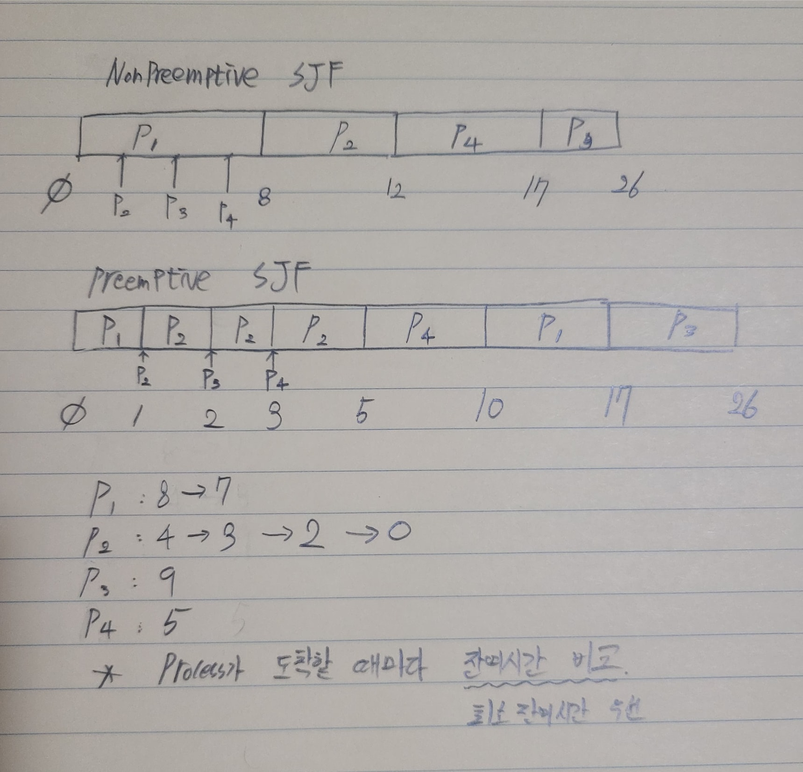

## CPU Scheduling

```
Ready Queue안에 여러 process들이 들어있을 때, 다음으로 CPU서비스를 받게할 process를 고르는 것
```

- Preemptive Scheduling vs Non-preemptive Scheduling

  - 선점 (先占) : 비선점(非先占)

  ```
  선점		:	CPU가 P1을 실행하고 있는데, 강제로 다른 Process를 실행할 수 있는 것

  비선점	:	CPU가 P1을 실행하고 있으면, 다른 Process 실행 불가
  					다른 P실행안되기 때문에 Scheduling이 일어나지 않음.
  ```

- Scheduling criteria

```
Scheduling 방식의 척도 : 어떤 Scehduling이 좋은지(효율적인지)
```

- CPU Utilization (CPU 이용률) 단위 %
  ```
  CPU가 얼마나 놀지않고 일하는지
  ```
- Throughput (처리율) 단위 jobs/sec
  ```
  단위 시간당(초,분,시간 몰라) 몇 개의 작업을 처리하는가
  ```
- Turnaround time (반환시간) 단위 sec hour ...
  ```
  Ready Queue 입장 ~ terminated(종료)될 때까지 걸리는 시간
  ```
- Waiting time (대기시간) 단위 sec
  ```
  CPU의 서비스를 받기 위해 Ready Queue에서 기다린 시간
  ```
- Response time (응답시간)
  ```
  대화형 컴퓨터에 중요한 척도
  응답까지 걸리는 시간
  ex) 인터넷 클릭해서 움직일 때까지
  ```
- …

</br></br>

## CPU Scheduling Algorithms

- First-Come, First-Served (FCFS)
  ```
  먼저온 놈먼저
  ```
- Shortest-Job-First (SJF)
  - Shortest-Remaining-Time-First
  ```
  빨리 끝나는 놈 먼저
  ```
- Priority
  ```
  우선 순위 먼저
  ```
- Round-Robin (RR)
  ```
  삥삥 돌면서 순서대로
  time sharing system
  ```
- Multilevel Queue
  ```
  Ready Queue를 여러개 두는 것
  ```
- Multilevel Feedback Queue
  ```
  Queue를 여러개 두는 것
  ```

</br></br>

## First-Come, First-Served(FCFS)

- Simple & Fair

- Gantt Chart

| Process | Burst Time (msec) |
| ------- | ----------------- |
| P1      | 24                |
| P2      | 3                 |
| P3      | 3                 |

- Example: Find Average Waiting Time

  ```
  AWT(평균 대기시간 구하기)
  P1이 기다린 시간 : 0
  P2가 기다린 시간 : 24
  P3가 기다린 시간 : 27
  AWT = (0+24+27)/3 = 17 msec
  ```

- Convoy Effect (호위효과)

```
P1이 일이 끝날 때 동안 P1뒤에서 대기 : P1을 P2,P3가 호위하는 것 처럼 보인다.
```

- Nonpreemptive scheduling

```
P1이 끝날 때까지 다른 P는 실행 안됨
```

## Shortest-Job-First (1)

- Provably optimal(대체적으로 최적화되어있다. 이상적방법)
- Not realistic; prediction may be needed
  (현실적이지 않다. 예측이 필요하다.)

| Process | Burst Time (msec) |
| ------- | ----------------- |
| P1      | 6                 |
| P2      | 8                 |
| P3      | 7                 |
| P4      | 3                 |

- SJF AWT

```
짧은 Process먼저 실행
(3 + 9 + 16) / 4 = 7
```

- FCFS AWT

```
(6 + 14 + 21) / 4 = 10.25
```

## Shortest-Job-First (2)

- Preemptive or Nonpreemtive
  - cf. Shortest-Remaining-Time-First (최소잔여시간 우선)

| Process | Arrival Time | Burst Time(msec) |
| ------- | ------------ | ---------------- |
| P1      | 0            | 8                |
| P2      | 1            | 4                |
| P3      | 2            | 9                |
| P4      | 3            | 5                |

- Example

  - Nonpreemptive SJF AWT

  ```
  	P1	P2				 P3						P4
  { 0 + 7(8 - 1) + 15(17 - 2) + 9(12 - 3)}  /  4  = 7.75
  ```

  - Preemptive SJF AWT

  ```
  		P1 					P2					P3						P4
  { 9(10 -1)  +   0    +	 15(17 -2)  +  	2(5-3)  }  /4   =  6.5
  ```

  - 
