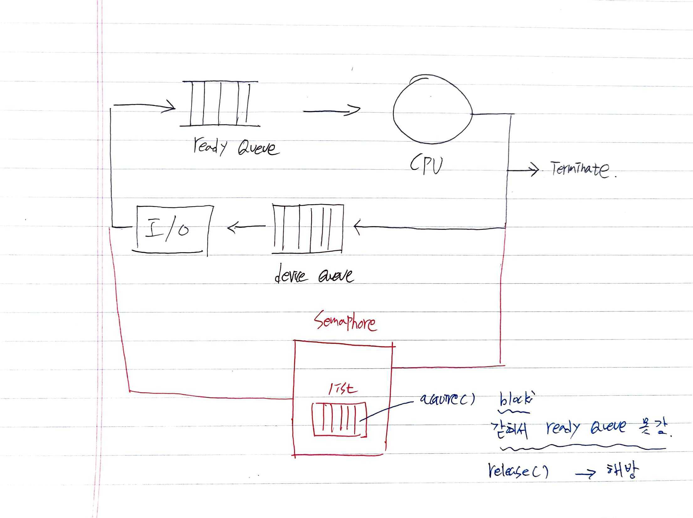

## 프로세스 동기화

- Process Synchronization
  - Concurrent access to shared data may result in data
    inconsistency
  - Orderly execution of cooperating processes so that data
    consistency is maintained
- Example: BankAccount Problem (은행계좌문제)
  - 부모님은 은행계좌에 입금; 자녀는 출금
  - 입금(deposit)과 출금(withdraw) 은 독립적으로 일어난다

```java
class Test {
    public static void main(String[] args) throws InterruptedException {
        BankAccount b = new BankAccount();
        Parent p = new Parent(b);
        Child c = new Child(b);
        p.start();
        c.start();
        p.join();
        c.join();
        System.out.println( "\nbalance = " + b.getBalance());
    }
}

class BankAccount {
    int balance;
    void deposit(int amount) {
        balance = balance + amount;
    }
    void withdraw(int amount) {
        balance = balance - amount;
    }
    int getBalance() {
        return balance;
    }
}

class Parent extends Thread {
    BankAccount b;
    Parent(BankAccount b) {
        this.b = b;
    }
    public void run() {
        for (int i=0; i<100; i++)
            b.deposit(1000);
    }
}

class Child extends Thread {
    BankAccount b;
    Child(BankAccount b) {
        this.b = b;
    }
    public void run() {
        for (int i=0; i<100; i++)
            b.withdraw(1000);
    }
}
```

</br></br>

## BankAccount Problem

- 입출금 동작 알기 위해 "+", "-" 출력하기
- 입출금 동작에 시간 지연 추가
  - 잘못된 결과값
  - 이유: 공통변수(common variable)에 대한 동시 업데이트 (concurrent update)
  - 해결: 한번에 한 쓰레드만 업데이트하도록 → 임계구역 문제
    ```
    공통 변수 balance에 대해서 입금, 출금을 하는데 입금 or 출금중에 Thread Switching이 일어나면
    balance가 0 이아닌 양수 or 음수가 됨
    ```

## 임계구역 문제

- The Critical-Section(임계구역) Problem
- Critical section

  - A system consisting of multiple threads
    ```
    여러개로 이루어진 Process에서
    ```
  - Each thread has a segment of code, called critical section, in which the thread may be changing common variables, updating a table, writing a file, and so on.

    ```
    여러 쓰레드들(2개이상)이 Common variables를 updating하는 구간을 임계구역이라고 한다.

    임계구역(Critical Section)
    balance(Common variable) = balance + n
    balance = balance - n
    ```

- Solution(해결방법)
  - Mutual exclusion (상호배타): 오직 한 쓰레드만 진입
    ```
    Common variable에 1개의 Thread만 진입가능
    ```
  - Progress (진행): 진입 결정은 유한 시간 내
    ```
    어느 Thread가 먼저 들어갈 것인지
    parent or child
    ```
  - Bounded waiting (유한대기): 어느 쓰레드라도 유한 시간 내 Critical-Section에 진입가능

</br></br>

## 프로세스/쓰레드 동기화

- 임계구역 문제 해결 (틀린 답이 나오지 않도록)
- 프로세스 실행 순서 제어 (원하는대로)
- Busy wait 등 비효율성은 제거

## O/S역할

1. process management
   - cpu scheduling
   - syncronigation(프로세스 실행 순서 제어)
2. Memory management
   ...

## 동기화 도구

- Synchronization Tools
  - Semaphores
  - Monitors
  - Misc.
- Semaphores (세마포)
  - 동기화 문제 해결을 위한 소프트웨어 도구
  - 네덜란드의 Edsger Dijkstra 가 제안
  - 구조: 정수형 변수 + 두 개의 동작 (P, V)

## 세마포 (Semaphore)

- 동작
  - P: Proberen (test) → acquire()
  - V: Verhogen (increment) → release()
- 구조

```java
class Semaphore {
    int value; // number of permits
    Semaphore(int value) {
    ...
    }
    void acquire() {
    ...
    }
    void release() {
    ...
    }
}
```

## 세마포 (Semaphore)

```java
void acquire() {
    value--;//number of permits(권한의 개수)
    //위에서 말한 정수형 변수
    if (value < 0) {
        add this process,thread to list;
        //list : process순서가 들어있음
        block;
        //갇힘
    }
}

void release() {
    value++;
    if (value <= 0) {
        remove a process P from list;
        wakeup P;
    }
}
```



## 세마포 (Semaphore)

- 일반적 사용 (1): Mutual exclusion(상호 배타 목적)
- 

  - sem.value = 1; -> Process 1놈만 허용한다

    ```
    1. sem.acquire();
    - value = 0. block x -> Critical-Section 진입
    - 다음 프로세스 들어옴.
    - value = -1. block o -> Critical-Section 진입x
      list(Queue)안에 갇힘

    2. Critical-Section


    3. sem.release();
    - list에 갇힌 Process깨움(value +1) -> Ready Queue -> CPU
      -> sem.acquire() -> Critical-Section

    ```

- 예제: BankAccount Problem
  - java.util.concurrent.Semaphore
