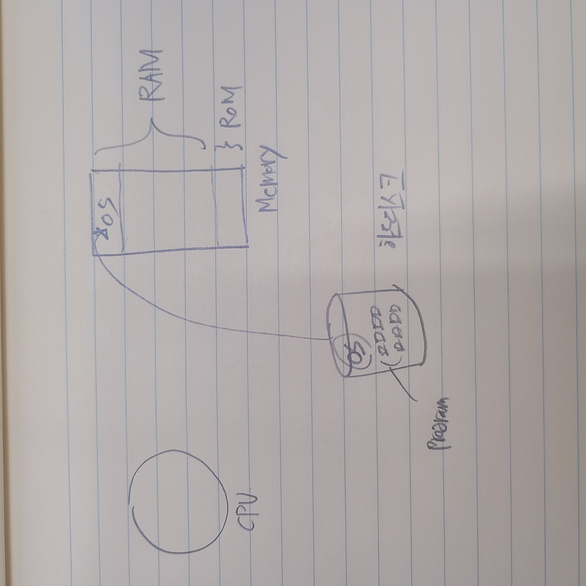

# 프로세스 관리(Process Management)

## 프로세스
- 프로그램 vs 프로세스 (program vs process)
   - process, task, job …
   - program in execution: text + data + stack, pc, sp, registers, …
   - 무덤 속 프로그램(하드디스크), 살아 움직이는 프로세스(메모리에 적재됬을 때)
- 프로세스 상태
   - new, ready, running, waiting, terminated (그림) 
   #new : app이 하드디스크에서 메인 메모리로 올라온 상태  
   #ready : 실행할 준비가 다 된 상태  
   #running : cpu가 실행하는 프로그램(process상태)  
   #waiting :   
   ex)멀티프로그램 시스템일 경우  
    ex)time sharing시스템은 waiting을 거치지 않음     
   #terminated : 프로그램이 끝난 상태    
   - 
   - 프로세스 상태 천이도 (process state transition diagram) 
   - 상태 천이는 언제 발생?

### 필기
