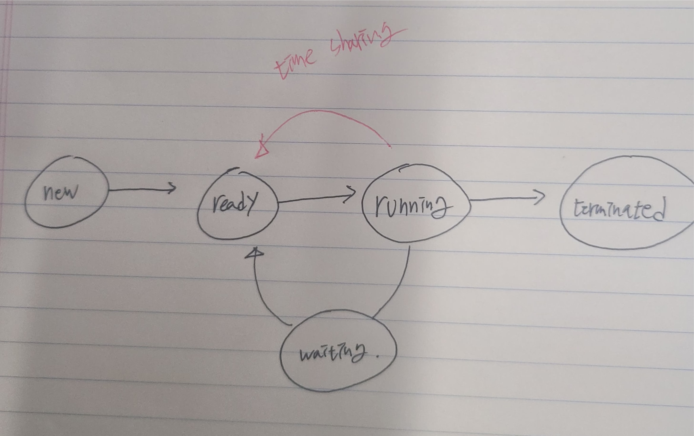

# 프로세스 관리(Process Management)

## 프로세스
- 프로그램 vs 프로세스 (program vs process)
   - process, task, job …(셋 다 같은 의미로 쓰임)
   - program in execution: text + data + stack, pc, sp, registers, …

   - 무덤 속 프로그램(하드디스크), 살아 움직이는 프로세스(메모리에 적재됬을 때)
   - 
- 프로세스 상태
   - ### new, ready, running, waiting, terminated (그림)   
        ```
        #new : app이 하드디스크에서 메인 메모리로 올라온 상태  
        #ready : 실행할 준비가 다 된 상태  
        #running : cpu가 실행하는 프로그램(process상태)  
        #waiting :   
        ex)멀티프로그램 시스템일 경우  
        ex)time sharing시스템은 waiting을 거치지 않음     
        #terminated : 프로그램이 끝난 상태    
        ```
   - 

   - 프로세스 상태 천이도 (process state transition diagram) 

   - 상태 천이는 언제 발생?


## PCB
- Process Control Block (PCB)
   - Task Control Block (TCB) – 프로세스에 대한 모든 정보를 담고 있다.
   ```
    - PCB의 다른 말로 TCB라고 부름
    - 1개의 process에 대해 1개의 PCB할당(1:1 대응)
    - I/O가 발생하면 Process1에서 Process2로 넘어가고 다시 Process1에 돌아와 명령어를 수행할 때 PCB1에 담긴 다음 명령어를 실행. (이것을 할 수 있게 PCB가 도와줌) 
   ```

   - process state (running, ready, waiting, …), PC, registers,
MMU info (base, limit), CPU time, process id, list of open files, …

   - 사람과 비유?

   - OS의 Process관리 부서에 소속되어있다.

## Queues
- Job Queue(하드디스크 -> 메인메모리)
  - Job scheduler 
  ```
  하드디스크 프로그램이 실행되면 바로 메인 메모리로 가는 것이 아니라 Queues에 의해 기다림
  Job Queue에서 메인메모리로 가려는 프로그램중 어느 프로그램을 먼저 올리는지에 대한 방법
  ```
  - Long-term scheduler(Job scheduler의 다른 말)
  ```
  프로그램이 끝나야만(=메인 메모리에 공간이 생겨야만) 다른 프로그램이 적재되기 때문에 term이 길다.(CPU scheduler에 비해)
  ```
- Ready Queue(메인메모리 -> CPU)
  - CPU scheduler(=short-term scheduler)
  ```
    메인메모리에서 기다리는 명령어(text,data,stack)에서 어느 명령어를 cpu서비스 받게 해줄 것인지에 대한 방법
  ``` 
  - Short-term scheduler
- Device Queue(프린트(I/O), device)
  - Device scheduler

```
하드디스크 프로그램이 실행되면 바로 메인 메모리로 가는 것이 아니라 Queues에 의해 기다림
```

## Multiprogramming
- Degree of multiprogramming
```
메인 메모리에 프로그램이 얼마나 적재되어있냐(process가 몇개냐)를 묻는 것
```
- i/o-bound vs CPU-bound process(작업(process)의 종류)
```
i/o-bound proces : process들이 하는 일들이 주로 i/o를 하는 것 
ex) 문서작업
CPU-bound process : process들이 주로 하는 일들이 계산
ex) 기상청 날씨 계산
Job scheduler가 CPU만 or I/O만 쓰여지지않도록 적절히 조정해주는 역할
```
- Medium-term scheduler
  - Swapping
  ```
  메인 메모리에 적재되어있지만 아무 작업도 안하는 프로그램을 하드디스크로 내려보내는 것 + 새로운 프로그램 적재
  ```
- Context switching (문맥전환)
  - Scheduler 
  
  - Dispatcher 
  - Context switching overhead
